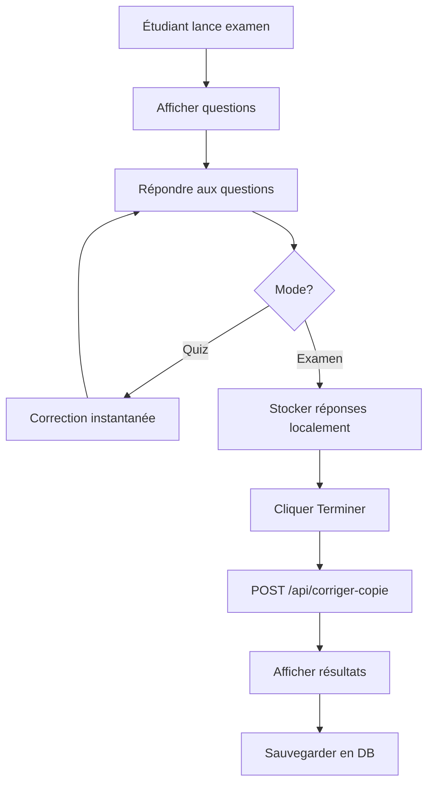

# 📘 Guide d'Intégration Frontend - API Correction IA

**Pour développeur Frontend** | Documentation complète pour intégration

---

## 🎯 Vue d'ensemble

### Qu'est-ce que cette API ?

Une API REST qui **corrige automatiquement** des épreuves (examens, contrôles) avec 4 types de questions :

| Type | Technologie | Temps moyen |
|------|-------------|-------------|
| **QCM** | Comparaison exacte | < 1ms |
| **Calcul** | SymPy (math symbolique) | < 50ms |
| **Courte** | IA sémantique (Transformers) | ~200ms |
| **Longue** | LLM (Mistral via Ollama) | ~2-5s |

---

## 🏗️ Architecture Simplifiée

```
┌─────────────────┐
│  VOTRE FRONTEND │ (Vue.js/React/Angular)
└────────┬────────┘
         │ HTTP REST (JSON)
         ▼
┌─────────────────┐
│   API FastAPI   │ http://localhost:8000
│  (Port 8000)    │
└────────┬────────┘
         │
         ├─► QCM Corrector (algo simple)
         ├─► Calcul Corrector (SymPy)
         ├─► Courte Corrector (IA Sentence Transformers)
         └─► Longue Corrector (LLM Ollama/Mistral)
```

---

## 📡 Endpoints de l'API

### 1. **Vérifier l'état de l'API** ✅

```http
GET http://localhost:8000/health
```

**Réponse :**
```json
{
  "status": "healthy",
  "moteur": "opérationnel",
  "modules": {
    "qcm": true,
    "calcul": true,
    "courte": true,    // true si modèle IA chargé
    "longue": false    // true si Ollama connecté
  }
}
```

**Quand l'utiliser :**
- Au démarrage de votre app (vérifier que l'API est up)
- Avant de proposer certains types de questions (ex: désactiver questions longues si `longue: false`)

---

### 2. **Corriger UNE question** 📝

```http
POST http://localhost:8000/api/corriger-question
Content-Type: application/json
```

**Body de la requête :**
```json
{
  "question": {
    "id": "q1",
    "type": "qcm",              // "qcm" | "calcul" | "courte" | "longue"
    "matiere": "reseau",        // "mathematiques" | "physique" | "reseau" | "informatique" | "autre"
    "enonce": "Quel protocole utilise le port 80?",
    "points_max": 2,
    "reponse_attendue": "B",
    "options": ["A. FTP", "B. HTTP", "C. SMTP", "D. SSH"]  // Seulement pour QCM
  },
  "reponse": {
    "question_id": "q1",
    "reponse": "B",
    "temps_reponse": 15         // optionnel (en secondes)
  }
}
```

**Réponse :**
```json
{
  "question_id": "q1",
  "points_obtenus": 2.0,
  "points_max": 2.0,
  "pourcentage": 100.0,
  "est_correct": true,
  "feedback": "✓ Correct ! La bonne réponse était bien B.",
  "details": {
    "reponse_eleve": "B",
    "reponse_correcte": "B"
  },
  "methode_correction": "Comparaison directe"
}
```

**Cas d'usage :**
- Correction instantanée après chaque question (mode quiz interactif)
- Afficher feedback immédiat à l'étudiant

---

### 3. **Corriger UNE copie complète** 📄

```http
POST http://localhost:8000/api/corriger-copie
Content-Type: application/json
```

**Body de la requête :**
```json
{
  "evaluation": {
    "id": "eval_01",
    "titre": "Contrôle Réseau - Semestre 1",
    "matiere": "reseau",
    "duree_minutes": 60,
    "bareme_total": 20,
    "questions": [
      {
        "id": "q1",
        "type": "qcm",
        "matiere": "reseau",
        "enonce": "Le modèle OSI comporte combien de couches?",
        "points_max": 2,
        "reponse_attendue": "C",
        "options": ["A. 5", "B. 6", "C. 7", "D. 8"]
      },
      {
        "id": "q2",
        "type": "calcul",
        "matiere": "reseau",
        "enonce": "Nombre d'hôtes pour un /24",
        "points_max": 3,
        "reponse_attendue": "254",
        "tolerance": 0
      },
      {
        "id": "q3",
        "type": "courte",
        "matiere": "reseau",
        "enonce": "Rôle d'un routeur?",
        "points_max": 5,
        "reponse_attendue": "Diriger les paquets entre réseaux"
      }
    ]
  },
  "copie": {
    "evaluation_id": "eval_01",
    "eleve_id": "user_123",
    "eleve_nom": "Marie DUPONT",
    "date_soumission": "2026-01-08T14:30:00",
    "reponses": [
      { "question_id": "q1", "reponse": "C" },
      { "question_id": "q2", "reponse": "254" },
      { "question_id": "q3", "reponse": "Le routeur connecte les réseaux" }
    ]
  }
}
```

**Réponse :**
```json
{
  "copie": {
    "evaluation_id": "eval_01",
    "eleve_id": "user_123",
    "eleve_nom": "Marie DUPONT",
    "date_soumission": "2026-01-08T14:30:00",
    "reponses": [...]
  },
  "resultats": [
    {
      "question_id": "q1",
      "points_obtenus": 2.0,
      "points_max": 2.0,
      "pourcentage": 100.0,
      "est_correct": true,
      "feedback": "✓ Correct !",
      "methode_correction": "Comparaison directe"
    },
    {
      "question_id": "q2",
      "points_obtenus": 3.0,
      "points_max": 3.0,
      "pourcentage": 100.0,
      "est_correct": true,
      "feedback": "✓ Correct ! Résultat: 254.0",
      "methode_correction": "Comparaison numérique"
    },
    {
      "question_id": "q3",
      "points_obtenus": 4.25,
      "points_max": 5.0,
      "pourcentage": 85.0,
      "est_correct": true,
      "feedback": "✓ Bonne réponse (similarité sémantique: 85%)",
      "details": {
        "similarite_semantique": 0.85
      },
      "methode_correction": "Analyse sémantique"
    }
  ],
  "note_totale": 9.25,
  "note_max": 10.0,
  "pourcentage_global": 92.5,
  "appreciation": "Excellent travail. 3/3 questions maîtrisées. Très bonne maîtrise du sujet, continuez ainsi !"
}
```

**Cas d'usage :**
- Quand l'étudiant termine un examen complet
- Afficher les résultats détaillés avec note finale

---

### 4. **Corriger PLUSIEURS copies** 👥

```http
POST http://localhost:8000/api/corriger-copies
Content-Type: application/json
```

**Body :**
```json
{
  "evaluation": { ... },  // Même structure que ci-dessus
  "copies": [
    {
      "evaluation_id": "eval_01",
      "eleve_id": "user_123",
      "eleve_nom": "Marie DUPONT",
      "reponses": [...]
    },
    {
      "evaluation_id": "eval_01",
      "eleve_id": "user_456",
      "eleve_nom": "Paul MARTIN",
      "reponses": [...]
    }
  ]
}
```

**Réponse :** Tableau de `ResultatEvaluation[]`

**Cas d'usage :**
- Correction en masse (prof corrige toute la classe)
- Export Excel/PDF de toutes les notes

---

### 5. **Obtenir statistiques classe** 📊

```http
GET http://localhost:8000/api/stats-classe
```

**Réponse :**
```json
{
  "nb_eleves": 25,
  "moyenne": 13.5,
  "note_min": 8.0,
  "note_max": 19.5,
  "pourcentage_moyen": 67.5,
  "repartition": {
    "excellent": 8,      // ≥75%
    "bon": 12,          // 50-75%
    "insuffisant": 5    // <50%
  }
}
```

---

### 6. **Lister types de questions supportés** 📋

```http
GET http://localhost:8000/api/types-questions
```

**Réponse :**
```json
{
  "types_supportes": [
    {
      "type": "qcm",
      "description": "Questions à choix multiples",
      "methode": "Comparaison directe"
    },
    {
      "type": "calcul",
      "description": "Calcul mathématique/physique",
      "methode": "Vérification symbolique (SymPy)"
    },
    {
      "type": "courte",
      "description": "Réponse courte",
      "methode": "Analyse sémantique (IA)"
    },
    {
      "type": "longue",
      "description": "Question à développement",
      "methode": "Évaluation LLM (Ollama)"
    }
  ]
}
```

---

## 🔧 Exemples d'Intégration par Framework

### Vue.js / Nuxt.js

```javascript
// services/correctionApi.js
import axios from 'axios'

const API_BASE_URL = 'http://localhost:8000'

export const correctionApi = {
  // Vérifier état API
  async healthCheck() {
    const { data } = await axios.get(`${API_BASE_URL}/health`)
    return data
  },

  // Corriger une question
  async corrigerQuestion(question, reponse) {
    const { data } = await axios.post(
      `${API_BASE_URL}/api/corriger-question`,
      { question, reponse }
    )
    return data
  },

  // Corriger une copie complète
  async corrigerCopie(evaluation, copie) {
    const { data } = await axios.post(
      `${API_BASE_URL}/api/corriger-copie`,
      { evaluation, copie }
    )
    return data
  },

  // Corriger plusieurs copies
  async corrigerPlusieurs(evaluation, copies) {
    const { data } = await axios.post(
      `${API_BASE_URL}/api/corriger-copies`,
      { evaluation, copies }
    )
    return data
  }
}
```

**Utilisation dans un composant :**
```vue
<script setup>
import { ref } from 'vue'
import { correctionApi } from '@/services/correctionApi'

const resultat = ref(null)
const loading = ref(false)

async function soumettreCopie() {
  loading.value = true
  
  try {
    const evaluation = {
      id: 'eval_01',
      titre: 'Contrôle Réseau',
      matiere: 'reseau',
      duree_minutes: 60,
      bareme_total: 20,
      questions: [/* vos questions */]
    }
    
    const copie = {
      evaluation_id: 'eval_01',
      eleve_id: currentUser.id,
      eleve_nom: currentUser.nom,
      reponses: formReponses.value
    }
    
    resultat.value = await correctionApi.corrigerCopie(evaluation, copie)
    
    // Afficher résultats
    console.log(`Note: ${resultat.value.note_totale}/${resultat.value.note_max}`)
    
  } catch (error) {
    console.error('Erreur correction:', error)
  } finally {
    loading.value = false
  }
}
</script>
```

---

### React / Next.js

```typescript
// lib/correctionApi.ts
const API_BASE_URL = 'http://localhost:8000'

interface Question {
  id: string
  type: 'qcm' | 'calcul' | 'courte' | 'longue'
  matiere: string
  enonce: string
  points_max: number
  reponse_attendue: string
  options?: string[]
  criteres_evaluation?: string[]
  tolerance?: number
}

interface ReponseEleve {
  question_id: string
  reponse: string
  temps_reponse?: number
}

interface ResultatCorrection {
  question_id: string
  points_obtenus: number
  points_max: number
  pourcentage: number
  est_correct: boolean
  feedback: string
  details?: any
  methode_correction: string
}

export async function corrigerQuestion(
  question: Question, 
  reponse: ReponseEleve
): Promise<ResultatCorrection> {
  const response = await fetch(`${API_BASE_URL}/api/corriger-question`, {
    method: 'POST',
    headers: { 'Content-Type': 'application/json' },
    body: JSON.stringify({ question, reponse })
  })
  
  if (!response.ok) {
    throw new Error('Erreur lors de la correction')
  }
  
  return response.json()
}

export async function corrigerCopie(evaluation: any, copie: any) {
  const response = await fetch(`${API_BASE_URL}/api/corriger-copie`, {
    method: 'POST',
    headers: { 'Content-Type': 'application/json' },
    body: JSON.stringify({ evaluation, copie })
  })
  
  return response.json()
}
```

**Hook personnalisé :**
```typescript
// hooks/useCorrection.ts
import { useState } from 'react'
import { corrigerCopie } from '@/lib/correctionApi'

export function useCorrection() {
  const [loading, setLoading] = useState(false)
  const [resultat, setResultat] = useState(null)
  const [error, setError] = useState(null)
  
  const soumettre = async (evaluation, copie) => {
    setLoading(true)
    setError(null)
    
    try {
      const data = await corrigerCopie(evaluation, copie)
      setResultat(data)
      return data
    } catch (err) {
      setError(err.message)
      throw err
    } finally {
      setLoading(false)
    }
  }
  
  return { soumettre, resultat, loading, error }
}
```

**Utilisation :**
```tsx
function ExamPage() {
  const { soumettre, resultat, loading } = useCorrection()
  
  const handleSubmit = async () => {
    const data = await soumettre(evaluation, copie)
    console.log('Note:', data.note_totale)
  }
  
  return (
    <div>
      <button onClick={handleSubmit} disabled={loading}>
        {loading ? 'Correction...' : 'Soumettre'}
      </button>
      
      {resultat && (
        <div>
          <h2>Résultats</h2>
          <p>Note: {resultat.note_totale} / {resultat.note_max}</p>
          <p>{resultat.appreciation}</p>
        </div>
      )}
    </div>
  )
}
```

---

## 🎨 Cas d'usage UI/UX

### Scénario 1 : Quiz Interactif (correction immédiate)

```javascript
// L'étudiant répond à une question → feedback instantané

async function repondreQuestion(questionId, reponse) {
  const question = questionnaire.find(q => q.id === questionId)
  
  const resultat = await correctionApi.corrigerQuestion(question, {
    question_id: questionId,
    reponse: reponse
  })
  
  // Afficher feedback immédiat
  if (resultat.est_correct) {
    afficherNotification('success', resultat.feedback)
  } else {
    afficherNotification('error', resultat.feedback)
  }
  
  // Passer à la question suivante
  questionSuivante()
}
```

**Timeline UX :**
1. Étudiant clique sur réponse B
2. → API call (~50-200ms)
3. → Feedback s'affiche : "✓ Correct !"
4. → Affichage note partielle : 2/2 pts
5. → Bouton "Question suivante" activé

---

### Scénario 2 : Examen Complet (correction à la fin)

```javascript
// L'étudiant soumet toutes ses réponses à la fin

async function soumettreExamen() {
  // Bloquer l'interface
  setLoading(true)
  
  const copie = {
    evaluation_id: examId,
    eleve_id: userId,
    eleve_nom: userName,
    reponses: reponsesEleve  // Toutes les réponses collectées
  }
  
  const resultat = await correctionApi.corrigerCopie(evaluation, copie)
  
  // Afficher page résultats
  naviguerVers('/resultats', { resultat })
}
```

**Timeline UX :**
1. Étudiant clique "Terminer l'examen"
2. → Modal confirmation
3. → Loading spinner (~2-10s selon nb questions)
4. → Page résultats avec :
   - Note globale : 15.5/20
   - Appréciation
   - Détail par question (affichable/masquable)

---

### Scénario 3 : Correction Prof (toute la classe)

```javascript
// Le prof corrige toutes les copies d'un coup

async function corrigerClasse(evaluationId) {
  const evaluation = await getEvaluation(evaluationId)
  const copies = await getCopiesNonCorrigees(evaluationId)
  
  // Afficher progression
  setProgression(0)
  
  const resultats = await correctionApi.corrigerPlusieurs(evaluation, copies)
  
  // Sauvegarder en base
  await saveBulkResults(resultats)
  
  // Afficher statistiques
  afficherStatsClasse(resultats)
}
```

---

## 🚨 Gestion des Erreurs

### Erreurs HTTP à gérer

```javascript
try {
  const resultat = await correctionApi.corrigerCopie(evaluation, copie)
  
} catch (error) {
  if (error.response?.status === 500) {
    // Erreur serveur
    afficherErreur('Le serveur de correction rencontre un problème. Réessayez.')
    
  } else if (error.response?.status === 422) {
    // Validation Pydantic échouée
    afficherErreur('Données invalides. Vérifiez vos réponses.')
    console.error(error.response.data.detail)
    
  } else if (error.code === 'ECONNREFUSED') {
    // API non démarrée
    afficherErreur('Le service de correction est indisponible.')
    
  } else {
    afficherErreur('Erreur inconnue')
  }
}
```

### Timeouts

```javascript
// Pour questions longues (LLM peut prendre 5-10s)
const controller = new AbortController()
const timeoutId = setTimeout(() => controller.abort(), 30000)  // 30s max

try {
  const resultat = await fetch(url, {
    signal: controller.signal,
    // ...
  })
} catch (error) {
  if (error.name === 'AbortError') {
    afficherErreur('Correction trop longue, réessayez.')
  }
} finally {
  clearTimeout(timeoutId)
}
```

---

## 📊 Structure de Données Complète

### Type Question

```typescript
interface Question {
  id: string
  type: 'qcm' | 'calcul' | 'courte' | 'longue'
  matiere: 'mathematiques' | 'physique' | 'reseau' | 'informatique' | 'autre'
  enonce: string
  points_max: number
  reponse_attendue?: string
  
  // QCM uniquement
  options?: string[]
  
  // Questions longues uniquement
  criteres_evaluation?: string[]
  
  // Calculs uniquement
  tolerance?: number
  formule_symbolique?: string
}
```

### Type Réponse

```typescript
interface ReponseEleve {
  question_id: string
  reponse: string
  temps_reponse?: number  // en secondes
}
```

### Type Résultat

```typescript
interface ResultatCorrection {
  question_id: string
  points_obtenus: number
  points_max: number
  pourcentage: number
  est_correct: boolean
  feedback: string
  details?: Record<string, any>
  methode_correction: string
}
```

---

## 🔐 Sécurité & Performance

### CORS

L'API a CORS ouvert par défaut (`allow_origins: ["*"]`)

**⚠️ En production, restreindre :**
```python
# Dans ia_correction/api.py
app.add_middleware(
    CORSMiddleware,
    allow_origins=["https://votre-app.com"],  # ← Changer ici
    allow_credentials=True,
    allow_methods=["POST", "GET"],
    allow_headers=["*"],
)
```

### Rate Limiting (à implémenter)

Côté frontend, limiter les appels :
```javascript
// Debounce pour questions en temps réel
import { debounce } from 'lodash'

const corrigerAvecDebounce = debounce(async (question, reponse) => {
  await correctionApi.corrigerQuestion(question, reponse)
}, 500)  // Attendre 500ms après la frappe
```

### Cache

Mettre en cache les résultats déjà corrigés :
```javascript
const cacheResultats = new Map()

async function corrigerAvecCache(question, reponse) {
  const key = `${question.id}_${reponse.reponse}`
  
  if (cacheResultats.has(key)) {
    return cacheResultats.get(key)
  }
  
  const resultat = await correctionApi.corrigerQuestion(question, reponse)
  cacheResultats.set(key, resultat)
  
  return resultat
}
```

---

## 🎯 Workflow Complet (Exemple Réel)

### Côté Étudiant



### Code complet

```javascript
// Workflow étudiant
class ExamenController {
  constructor(evaluationId) {
    this.evaluation = null
    this.reponses = []
    this.resultat = null
  }
  
  async chargerExamen() {
    // 1. Récupérer l'évaluation depuis votre API backend
    this.evaluation = await fetch(`/api/evaluations/${evaluationId}`).then(r => r.json())
    
    // 2. Vérifier que l'API correction fonctionne
    const health = await correctionApi.healthCheck()
    if (health.status !== 'healthy') {
      throw new Error('Service correction indisponible')
    }
  }
  
  ajouterReponse(questionId, reponse) {
    // Stocker localement (pas encore corrigé)
    this.reponses.push({
      question_id: questionId,
      reponse: reponse,
      temps_reponse: calculerTemps()
    })
    
    // Sauvegarder dans localStorage (au cas où refresh)
    localStorage.setItem('reponses_temp', JSON.stringify(this.reponses))
  }
  
  async soumettre() {
    // 3. Préparer la copie
    const copie = {
      evaluation_id: this.evaluation.id,
      eleve_id: window.currentUser.id,
      eleve_nom: window.currentUser.nom,
      date_soumission: new Date().toISOString(),
      reponses: this.reponses
    }
    
    // 4. Envoyer à l'API correction
    this.resultat = await correctionApi.corrigerCopie(this.evaluation, copie)
    
    // 5. Sauvegarder le résultat dans votre DB
    await fetch('/api/resultats', {
      method: 'POST',
      body: JSON.stringify(this.resultat)
    })
    
    // 6. Nettoyer localStorage
    localStorage.removeItem('reponses_temp')
    
    // 7. Rediriger vers résultats
    window.location.href = `/resultats/${this.resultat.copie.eleve_id}`
  }
}
```

---

## 📦 Déploiement

### Docker Compose (recommandé)

```yaml
# docker-compose.yml
version: '3.8'

services:
  correction-api:
    build: ./projet_iut
    ports:
      - "8000:8000"
    environment:
      - OLLAMA_HOST=http://ollama:11434
    depends_on:
      - ollama
  
  ollama:
    image: ollama/ollama
    ports:
      - "11434:11434"
    volumes:
      - ollama_data:/root/.ollama
    command: serve

  frontend:
    build: ./sg-stocks-web
    ports:
      - "5173:5173"
    environment:
      - VITE_API_CORRECTION_URL=http://correction-api:8000

volumes:
  ollama_data:
```

**Lancer :**
```bash
docker-compose up -d
```

---

## ✅ Checklist Intégration

### Phase 1 : Setup (Développeur Backend/DevOps)
- [ ] Installer Python 3.9+
- [ ] `pip install -r requirements.txt`
- [ ] Installer Ollama + `ollama pull mistral`
- [ ] Tester : `python demarrage_rapide.py`
- [ ] Lancer API : `python -m ia_correction.api`
- [ ] Vérifier : `curl http://localhost:8000/health`

### Phase 2 : Intégration Frontend (Vous)
- [ ] Créer service API (`correctionApi.js`)
- [ ] Tester endpoint `/health` depuis frontend
- [ ] Implémenter correction question unique
- [ ] Implémenter correction copie complète
- [ ] Gérer erreurs (500, 422, timeout)
- [ ] Afficher feedback avec symboles ✓ ✗ ⚠
- [ ] Afficher note finale + appréciation
- [ ] Tester avec données réelles

### Phase 3 : Optimisation
- [ ] Ajouter cache résultats côté frontend
- [ ] Gérer timeouts (30s pour questions longues)
- [ ] Ajouter loading states
- [ ] Optimiser requêtes (éviter doublons)
- [ ] Tester performance (100+ copies)

### Phase 4 : Production
- [ ] Configurer CORS restrictif
- [ ] Ajouter authentification (JWT)
- [ ] Monitorer temps de réponse
- [ ] Logger erreurs
- [ ] Documenter pour équipe

---

## 🆘 FAQ Développeur

### Q : L'API est lente pour questions longues ?
**R :** Oui, normal. Le LLM (Ollama) prend 2-10s. Solutions :
- Afficher spinner avec message "Analyse en cours par IA..."
- Désactiver les questions longues si performances critiques
- Utiliser une file d'attente (Celery) pour correction asynchrone

### Q : Comment gérer si Ollama n'est pas installé ?
**R :** L'API détecte automatiquement. Vérifier `health.modules.longue`. Si `false` :
- Désactiver le type de question "longue" dans l'UI
- Afficher message : "Questions longues temporairement indisponibles"

### Q : Peut-on modifier les seuils de notation ?
**R :** Oui, dans `ia_correction/config.py` :
```python
SIMILARITE_EXCELLENTE = 0.85  # >= 95% des points
SIMILARITE_BONNE = 0.70       # >= 70% des points
```

### Q : Comment ajouter une nouvelle matière ?
**R :** Dans `ia_correction/models.py` :
```python
class Matiere(str, Enum):
    MATHEMATIQUES = "mathematiques"
    PHYSIQUE = "physique"
    RESEAU = "reseau"
    INFORMATIQUE = "informatique"
    CHIMIE = "chimie"  # ← Ajouter ici
    AUTRE = "autre"
```

### Q : L'API peut-elle gérer 1000 étudiants simultanés ?
**R :** Non par défaut (Uvicorn single process). Solutions :
- Utiliser Gunicorn avec workers multiples
- Ajouter une file d'attente (Redis + Celery)
- Load balancer

---

## 📞 Support

**Documentation API interactive :**  
→ `http://localhost:8000/docs` (Swagger UI auto-générée)

**Tester rapidement :**  
→ `python exemples.py`

**Vérifier santé système :**  
→ `curl http://localhost:8000/health`

---

**Prêt pour intégration ! 🚀**  
Pour toute question, référez-vous à ce guide ou consultez `/docs` de l'API.
